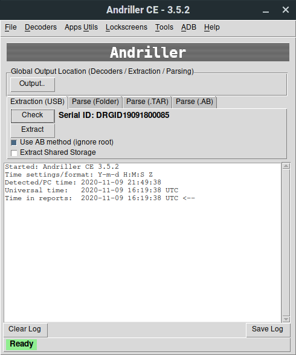
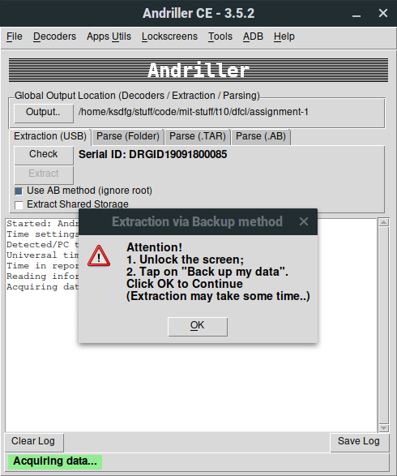
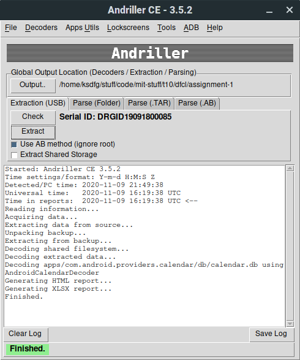
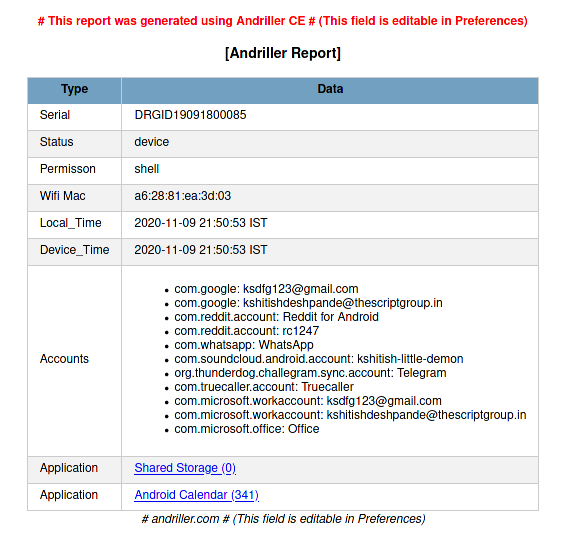

# Assignment 1

**Name** : Kshitish Deshpande

**Roll No.** : PA15

**Subject** : DFCL

### Andriller Logs

```
Started: Andriller CE 3.5.2
Time settings/format: Y-m-d H:M:S Z
Detected/PC time: 2020-11-09 21:49:38 
Universal time:   2020-11-09 16:19:38 UTC
Time in reports:  2020-11-09 16:19:38 UTC <--
Reading information...
Acquiring data...
Extracting data from source...
Unpacking backup...
Extracting from backup...
Decoding shared filesystem...
Decoding extracted data...
Decoding apps/com.android.providers.calendar/db/calendar.db using AndroidCalendarDecoder
Generating HTML report...
Generating XLSX report...
Finished.
``` 

### Screenshots







